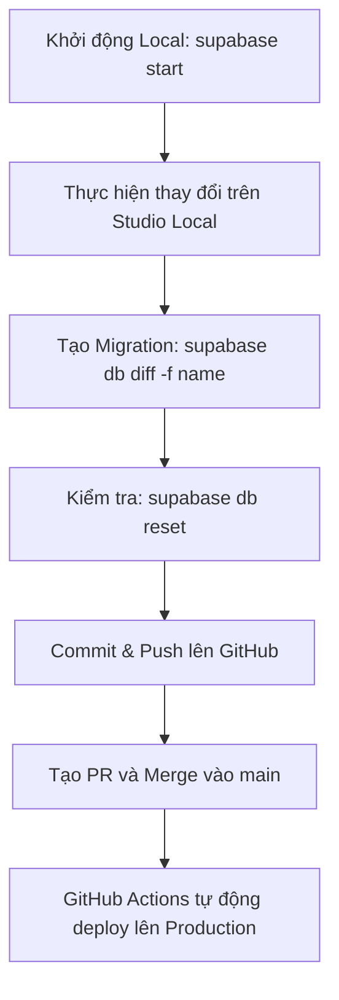

# 📚 Hướng Dẫn Quy Trình Làm Việc Supabase/Schema (E-Gift Space)

## Mục tiêu

Đảm bảo tất cả các thay đổi về cấu trúc Database (Bảng, Cột, RLS, Functions) đều được thực hiện nhất quán, được ghi lại bằng file Migration SQL, và triển khai tự động lên môi trường Production/Staging.

---

## 1. Môi trường Làm việc Cục Bộ (Local Development)

Mọi thay đổi cấu trúc DB đều phải được thực hiện trên môi trường Local trước khi tạo Migration.

### 1.1. Khởi động Stack Local

Trước khi bắt đầu, hãy đảm bảo Supabase Local đã chạy.

| Lệnh | Mô tả |
|------|------|
| `supabase start` | Khởi động các dịch vụ Supabase Local (Postgres, Studio, Auth, v.v.) |
| `supabase status` | Kiểm tra xem tất cả các dịch vụ có đang chạy hay không |

**Truy cập Studio Local:** http://127.0.0.1:55323

### 1.2. Đồng bộ Schema (Reset)

Khi bắt đầu một Sprint mới hoặc sau khi clone dự án, hãy đồng bộ DB Local với lịch sử Migration mới nhất từ Repo.

```bash
supabase db reset
```

> ⚠️ **Cảnh báo:** Lệnh này sẽ xóa sạch cơ sở dữ liệu Supabase Local và chạy lại tất cả các file Migration từ đầu.

---

## 2. Quy trình Thay đổi Cấu trúc (Schema Changes)

Đây là quy trình chuẩn để thêm bảng mới, cột mới, hoặc sửa đổi bất kỳ thành phần nào của DB.

### 2.1. Thực hiện Thay đổi

**Không viết SQL thủ công:** Không tự viết lệnh `CREATE TABLE` hay `ALTER TABLE`.

**Sử dụng Studio Local:** Truy cập Studio Local (http://127.0.0.1:55323/) và sử dụng giao diện Table Editor hoặc SQL Editor để thực hiện thay đổi.

| Hành động | Ví dụ |
|-----------|-------|
| Thêm Bảng/Cột | Thêm cột `listen_count` vào bảng `stories` |
| Thêm RLS | Thiết lập chính sách "Người dùng chỉ có thể xóa các Comment của họ" |
| Thêm Function/Trigger | Viết một hàm để cập nhật `updated_at` mỗi khi có thay đổi |

### 2.2. Tạo File Migration SQL

Sau khi thay đổi đã được thực hiện và kiểm tra trên Studio Local:

```bash
supabase db diff -f ten_goi_nho_cho_migration
```

**Ví dụ:**
```bash
supabase db diff -f add_listen_count_to_stories
```

Lệnh này sẽ tự động tạo một file SQL mới trong thư mục `supabase/migrations` chỉ chứa các lệnh cần thiết (như `ALTER TABLE ... ADD COLUMN ...`).

### 2.3. Kiểm tra Tính toàn vẹn

Mở file SQL vừa tạo và kiểm tra. Sau đó, chạy reset để đảm bảo nó chạy tốt từ đầu:

```bash
supabase db reset
```

Nếu `db reset` thành công, file migration của bạn là hợp lệ.

---

## 3. Quy trình Triển khai (Deployment)

Việc triển khai được thực hiện thông qua Git và GitHub Actions, không cần chạy lệnh thủ công lên Production.

### 3.1. Commit và Đẩy lên GitHub

**Commit file Migration:** Thêm và commit chỉ file SQL mới được tạo.

```bash
git add supabase/migrations/[timestamp]_ten_goi_nho.sql
git commit -m "feat(db): [ten_migration_ro_rang]"
```

**Tạo Pull Request (PR):** Đẩy lên branch làm việc và tạo PR để Merge vào branch chính (`main`/`develop`).

### 3.2. Triển khai Tự động

Khi PR được Merge vào branch `main` của Repo Schema, GitHub Actions sẽ tự động kích hoạt.

Workflow CI/CD sẽ chạy lệnh `supabase db push` bằng `SUPABASE_ACCESS_TOKEN` để áp dụng file Migration lên Supabase Cloud (Production).

---

## 4. ⚠️ Xử lý Lỗi `relation "..." already exists`

Lỗi này xảy ra khi bạn tạo lại một bảng đã có (ví dụ: `profiles`).

### Giải pháp:

1. Mở file Migration đang gây lỗi
2. Xóa bỏ toàn bộ lệnh `CREATE TABLE ...` và `CREATE UNIQUE INDEX ...` liên quan đến bảng đã tồn tại
3. Thay thế bằng lệnh `ALTER TABLE ... ADD COLUMN ...` hoặc các lệnh thay đổi khác
4. Chạy lại `supabase db push` để tiếp tục

---

## 5. Tóm tắt Quy trình



---

## 6. Lệnh Thường Dùng

| Lệnh | Mô tả |
|------|------|
| `supabase start` | Khởi động local development environment |
| `supabase stop` | Dừng local development environment |
| `supabase status` | Kiểm tra trạng thái các services |
| `supabase db reset` | Reset DB và chạy lại tất cả migrations |
| `supabase db diff -f <name>` | Tạo migration file từ thay đổi hiện tại |
| `supabase db push` | Deploy migrations lên cloud (production) |
| `supabase db pull` | Pull schema từ cloud về local |

---

## 7. Cấu trúc Thư mục

```
egift-space-database/
├── supabase/
│   ├── config.toml          # Cấu hình Supabase local
│   ├── migrations/           # Các file migration SQL
│   │   ├── 20251207090826_add_full_name_to_profiles.sql
│   │   ├── 20251208025318_add_story_stats.sql
│   │   └── 20251208030910_update_db.sql
│   └── seed.sql             # Dữ liệu seed (nếu có)
├── .github/
│   └── workflows/
│       └── deploy-db.yml    # GitHub Actions workflow
└── README.md
```

---

## 8. Best Practices

✅ **Nên làm:**
- Luôn test migration trên local trước khi push
- Đặt tên migration rõ ràng, mô tả đúng thay đổi
- Review migration file trước khi commit
- Sử dụng `supabase db diff` thay vì viết SQL thủ công

❌ **Không nên:**
- Viết migration SQL thủ công mà không qua Studio Local
- Push migration chưa được test trên local
- Sửa migration đã được deploy lên production
- Commit file migration với lỗi syntax

---

## 9. Troubleshooting

### Migration không chạy được trên local

```bash
# Reset lại database
supabase db reset

# Kiểm tra log
supabase logs
```

### Port đã được sử dụng

Nếu gặp lỗi port đã được sử dụng, sửa trong `supabase/config.toml`:

```toml
[api]
port = 54331  # Đổi sang port khác

[db]
port = 54332  # Đổi sang port khác
```

### GitHub Actions deploy thất bại

1. Kiểm tra secrets đã được setup đúng chưa:
   - `SUPABASE_ACCESS_TOKEN`
   - `SUPABASE_PROJECT_REF`
2. Xem log trong GitHub Actions để biết lỗi cụ thể
3. Test migration trên local trước khi push

